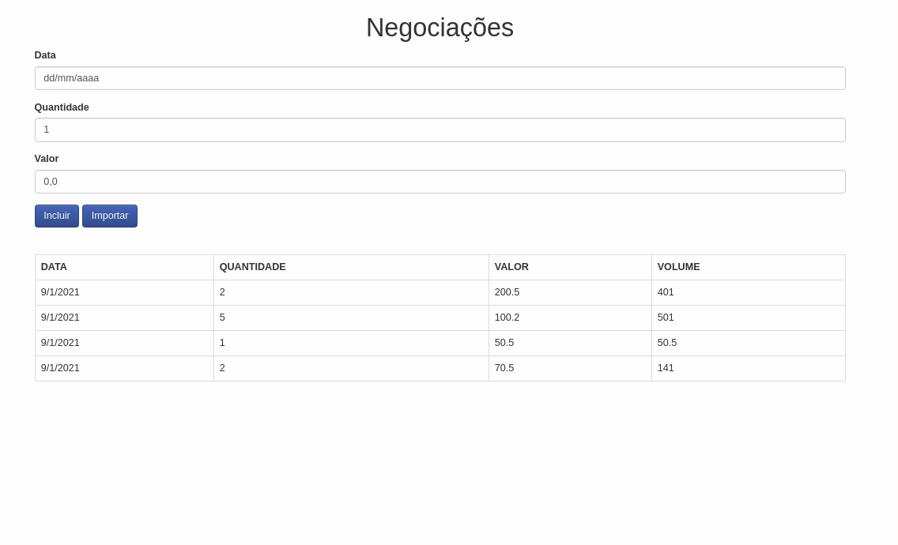

# AluraBank - Aplicação criada no curso de Typescript da Alura.

## Conteúdos abordados no curso
* Tipagem estática.
* Herança.
* Poliformismo.
* Typescript definitions.
* Decorations.
* Interfaces.
* Namespaces e módulos externos.
* Acesso ao API externa.
* Uso de padrões de projeto (Throttle).
* Boa práticas de código com Typescript.

### AluraBank - Inserção e Importação de negociações via acesso a uma API externaa.

